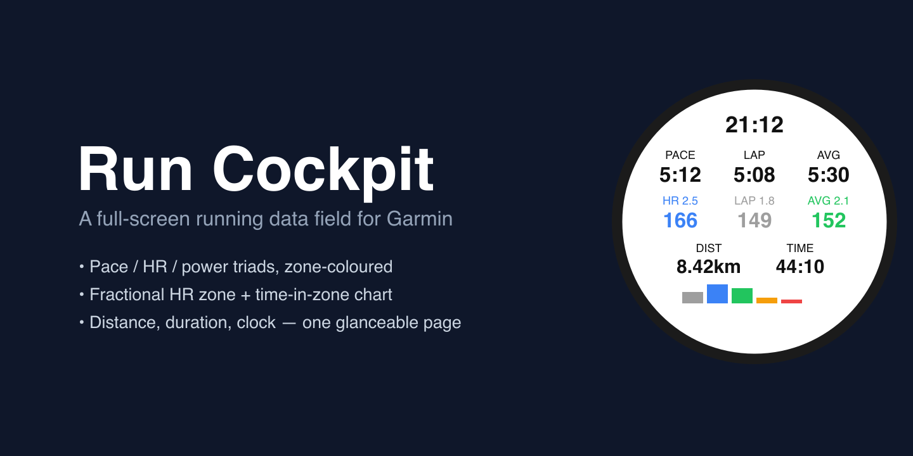

# Run Cockpit



**Run Cockpit** is a full-screen [Garmin Connect IQ](https://developer.garmin.com/connect-iq/)
**data field** for running. One glanceable page shows current / lap / average **pace or power** —
coloured by training zone — **heart rate** with a fractional zone number, a live **time-in-zone**
bar chart, plus distance, duration, average power, and the clock. On climbs it switches from pace to
power automatically, and back on the flat.

<!-- Public Connect IQ Store listing pending. Once it is live, replace the line below with the store link:
     **[Get it on the Connect IQ Store](https://apps.garmin.com/apps/<public-app-id>)** -->
_Coming to the Connect IQ Store._ · **[Settings & full feature docs](store-assets/description.txt)** · **[Changelog](CHANGELOG.md)**

## Features

- **Pace or power** as current / lap / average, coloured by training zone.
- **Terrain-adaptive** — on climbs the current and lap cells switch from pace to power, and back to
  pace on the flat (or force pace / power).
- **Heart rate** as current / lap / average, coloured by HR zone with a fractional zone number.
- **Time-in-zone bar chart** — each bar grows with the time spent in that zone, drawn in that zone's colour.
- **Distance, duration, and average power** always on screen (useful on hilly runs, where average
  pace alone misleads).
- **Pace-zone models** derived from your threshold pace: 80/20 Run, Joe Friel, CTS, MyProCoach, or
  your own custom boundaries.
- Large, bold numbers and high-contrast zone colours tuned for the sunlight (MIP) display, with a
  brighter palette on dark / AMOLED backgrounds.

Full setup and per-setting documentation: [store-assets/description.txt](store-assets/description.txt).

## Screenshots

_On-watch captures from a real run are coming here._
<!-- Add real screenshots: on the watch, Settings -> System -> Hot Keys -> Screenshot; files land in
     GARMIN/SCRNSHOT. The banner above is an illustrative mockup, not a current screenshot. -->

---

## Repository

An open-source monorepo of Garmin Connect IQ apps (Monkey C), structured to host multiple apps and
shared barrels.

| App | Type | Status |
|---|---|---|
| [`apps/run-cockpit`](apps/run-cockpit) | Data field | Full-screen running stats page |

- `apps/` — Connect IQ applications (one dir per app)
- `barrels/` — Shared Monkey C code (Connect IQ "barrels")
- `bin/` — Build output (gitignored)

## Development Setup

### Prerequisites
- macOS (or Linux/WSL) with [`just`](https://github.com/casey/just) and `openssl`.
- The **Connect IQ SDK**, via either:
  - GUI: `brew install --cask connectiq-sdk-manager`, sign in, download the latest SDK
    (Set as current) and the devices you target (at least one, e.g. **Enduro 3**) + simulator; or
  - CLI: [`connect-iq-sdk-manager`](https://github.com/lindell/connect-iq-sdk-manager-cli)
    (`login`, `sdk set <ver>`, `device download --manifest=apps/run-cockpit/manifest.xml`).
- A developer signing key: `just key` (gitignored; never commit it).

### Everyday loop

```sh
just doctor     # confirm SDK / device / key
just build      # compile -> bin/run-cockpit.prg   (override device: CIQ_DEVICE=<id> just build)
just sim        # launch the simulator (GUI)
just run        # build + run in the simulator
just sideload   # copy the .prg to a USB-mounted watch
```

The simulator opens blank — `just run` pushes the app into it. To advance the activity timer,
use **Simulation → Activity Data** in the simulator menu.

### Sideloading on macOS
Newer Garmin watches (incl. the Enduro 3) use **MTP**, which macOS does not mount as a disk
(`/Volumes/GARMIN` will be absent). Google's Android File Transfer is deprecated and unreliable
on recent macOS — use **[OpenMTP](https://openmtp.ganeshrvel.com/)** instead
(`brew install --cask openmtp`): connect the watch, then copy `bin/run-cockpit.prg` into
`GARMIN/APPS/` on the device and restart it.

### Releasing
Two Store listings (Public + private Beta) share one codebase and one version; `just release X.Y.Z`
builds both signed `.iq` at that version. Each listing shows its own "What's New"
([store-assets/whats-new.txt](store-assets/whats-new.txt) for Beta, generated from `CHANGELOG.md`;
[store-assets/whats-new-public.txt](store-assets/whats-new-public.txt) for Public, an authored folded
log). `just validate-store-text` validates the description and both. Every shipped version is tagged
(`just tag`); public milestones also get a GitHub Release (`just github-release X.Y.Z`). Publishing the
`.iq` is a manual dashboard step — see [RELEASE.md](RELEASE.md) and the `just publish-assist` recipe.

### VS Code
The official **Monkey C** extension reads `apps/run-cockpit/manifest.xml` and `monkey.jungle`
directly — open the repo and build/debug from the extension if you prefer a GUI workflow.

## License

MIT — see [LICENSE](LICENSE).
